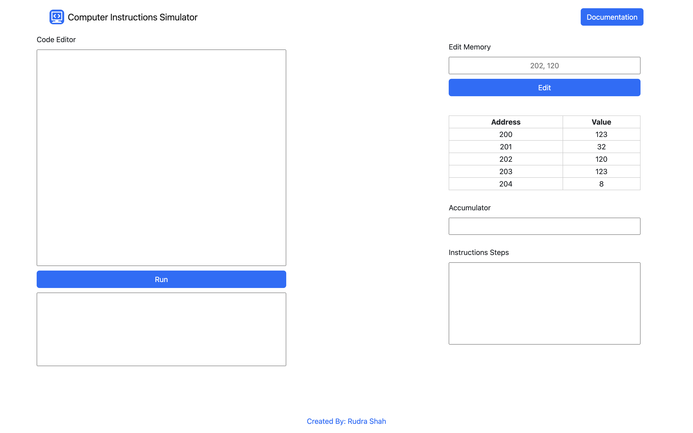
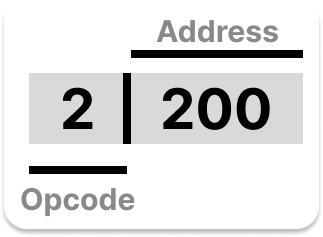

# Computer Instructions Simulator
This is a simple Computer Instructions Simulator. To make it simpler, The Address part of the instructions are in decimal. 
Try it out [http://isim.rudrashah.in](http://isim.rudrashah.in/) 
  

## Memory Related Instructions. 
`0200 -> AND OPERATIONS TO ACCUMULATOR FROM MEMORY WORD` 
`1200 -> ADD OPERATIONS TO ACCUMULATOR FROM MEMORY WORD` 
`2200 -> LOAD OPERATIONS TO ACCUMULATOR FROM MEMORY WORD` 
`3200 -> STORE OPERATIONS TO MEMORY WORD FROM ACCUMULATOR`
 
## Accumulator Related Instructions. 
`7020 -> INCREMENT OPERATIONS TO ACCUMULATOR` 
`7200 -> COMPLETE OPERATIONS TO ACCUMULATOR` 
`7080 -> CLEAR OPERATIONS TO ACCUMULATOR` 
`7080 -> CIRCULAR SHIFT RIGHT OPERATIONS TO ACCUMULATOR` 
`7040 -> CIRCULAR SHIFT LEFT OPERATIONS TO ACCUMULATOR` 
`7001 -> HALT`
 
 

# Code Breakdown
 
**All values are in Decimal AND using direct addressing so no need to add 0 in front*.
# Installation
1. Clone the repository
2. `pip install -r requirements.txt`
3. (optional) Add enviroment variables
4. `flask run`
# Contributors
feel free to contribute to this project as we want to make this simulator as efficient as possible.